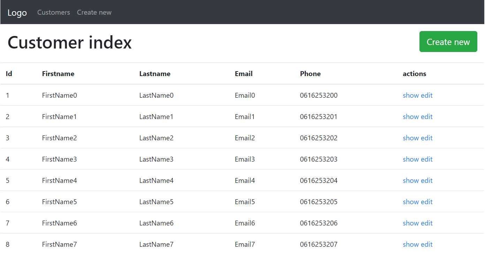

# Simple CRUD for Symfony 5

This is a FullStack App with Symfony 5, and use Bootstrap for layout.

The App contains a basic add, edit, display and remove Customer related to those users.

Looks like this:

In order to setup the app, please run this steps:

## Running the All:

1. Download this repo inside any Apache server instance in your computer: ... and be sure that your PHP version is >=5.5.9.
2. Create a local database and import the script in it, or use command:
    php bin/console make:migration
    php bin/console doctrine:migrations:migrate
3. symfony server:start
7. Now, you will have all the necessaries to run your App, in my case the local url is like this: http://127.0.0.1:8000/ (but it depends from your Apache setup)
